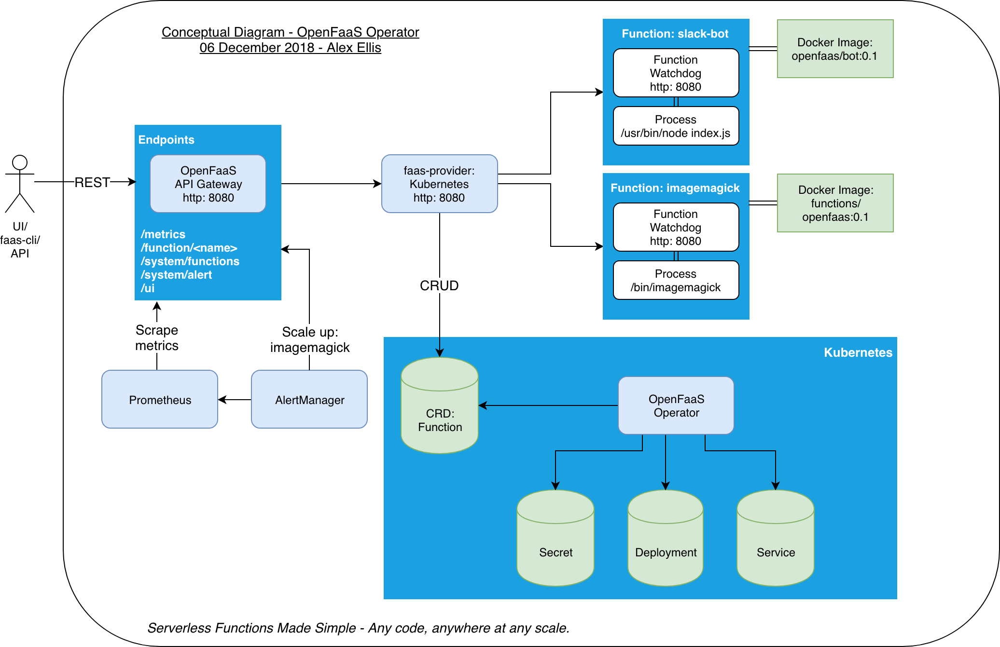

## OpenFaaS API Gateway / Portal

Conceptual design using the OpenFaaS operator faas-provider. Each function is built into an immutable Docker image before being deployed via the faas-cli, UI or REST API.

Click below to view the image full-size:

When deployed each function creates 1 to many Pods/containers depending on the minimum and maximum scaling parameters requested by the user. Functions can also scale to zero and back again through use of the [faas-idler](https://github.com/openfaas-incubator/faas-idler/) or REST API.

See also: [auto-scaling](autoscaling.md).

## Reference documentation

You can find the reference documentation and any additional settings for the API gateway in the README file for the gateway:

* [README.md](https://github.com/openfaas/faas/tree/master/gateway)

## Swagger

The OpenFaaS API exposes a RESTful API which is documented with Swagger.

### Explore or update the Swagger API documentation

The `swagger.yml` file can be viewed and edited in the Swagger UI.

* Head over to the [Swagger editor](http://editor.swagger.io/)

* Now click File -> Import URL

* Type in `https://raw.githubusercontent.com/openfaas/faas/master/api-docs/swagger.yml` and click OK

You can now view and edit the Swagger, copy back to your fork before pushing changes.

