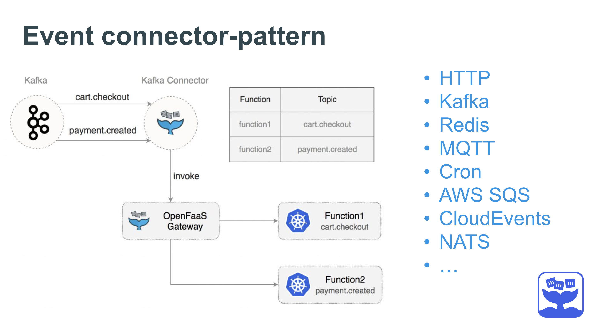

# Triggers

OpenFaaS functions can be triggered easily by any kind of event. A small piece of code will convert from the event-source and trigger the function using the OpenFaaS Gateway API.

The most common use-case is HTTP which acts as a lingua franca between internet-connected systems.

Looking to trigger a function on a schedule? Have a look at the [Cron page](/reference/cron/) for more information

## HTTP / webhooks

This is the default, and standard method for interacting with your Functions.

The function URL follows the pattern of:
```
https://<gateway URL>:<port>/function/<function name>
```

> There is also the ability to execute a function asynchronously by replacing `/function/` with `/async-function/` before the function name

## CLI

Trigger a function using the `faas-cli` by using the function name

```
echo "triggered" | faas-cli invoke figlet
```

> CLI invocation can also be async by passing the `-a` flag to the `invoke` call

## Other Event Sources

### Event-connector pattern

The OpenFaaS connector-pattern allows you to create a broker or separate microservice which maps functions to topics and invokes functions via the OpenFaaS Gateway meaning that the OpenFaaS code does not need to be modified per trigger/event-source.



#### Add your own event source

If you'd like to add an event source which is not listed below you can fork the OpenFaaS event [connector SDK](https://github.com/openfaas-incubator/connector-sdk) which is written in Go and use this to connect your pub/sub topics or message queues to functions in OpenFaaS.

### Apache Kafka

Connect your function(s) to [Apache Kafka](https://kafka.apache.org) topics.

More information in the Incubator repository: [openfaas-incubator/kafka-connector](https://github.com/openfaas-incubator/kafka-connector)

Support is available for OpenFaaS Gateways using Basic Authentication.

### AWS SNS

You can use AWS SNS to trigger functions using AWS SNS Notifications and Subscriptions. This approach can be used to export almost any data-source or event from your Amazon Web Services (AWS) console such as S3 of DynamoDB to an OpenFaaS function.

Find more information in the following repository: [affix/OpenFaaS-SNS](https://github.com/affix/OpenFaaS-SNS)

### Minio / S3

You can trigger OpenFaaS functions using Minio's webhook or Kafka integration.

* [Minio's webhook integration](https://blog.minio.io/introducing-webhooks-for-minio-e2c3ad26deb2)
* [Minio's Kafka integration](https://docs.minio.io/docs/minio-bucket-notification-guide.html#apache-kafka)

### CloudEvents

[CloudEvents](https://cloudevents.io/) is a specification for describing event data in a common way.

Follow this example to learn how to trigger functions using the Azure EventGrid and CloudEvents.

More information in the repository: [johnmccabe/cloudevents-slack-demo](https://github.com/johnmccabe/cloudevents-slack-demo)

### IFTTT

You can trigger OpenFaaS functions using webhooks sent via the (if this, then that) service.

An example may be triggering a function which forwards Tweets about your brand or project to a given Slack channel. For this combination use the "Twitter search" Applet and have it trigger the "Make a web request" Applet giving the public URL of your OpenFaaS gateway and the receiver function such as https://gw.my-company.com/function/slack-forwarder

See an example of a function built to forward Tweets from IFTTTT to Slack using Golang: [filter-tweets](https://github.com/openfaas-incubator/social-functions/blob/master/filter-tweets/handler.go).

Visit [ifttt.com](https://ifttt.com) to learn more.

### Redis (third-party project)

Invoke functions using Redis pub/sub and the [Sidekiq model](https://sidekiq.org).

View the [sidekiq-connector](https://github.com/affix/sidekiq-connector)

> Note: the Redis connector currently has no support for gateways using Basic Authentication, but [this is being worked on](https://github.com/affix/sidekiq-connector/issues/1) by the author.

### RabbitMQ (third-party project)

Invoke functions from RabbitMQ topics

More information in the repository: [Templum/rabbitmq-connector](https://github.com/Templum/rabbitmq-connector)

> Note: the RabbitMQ connector currently has no support for gateways using Basic Authentication, but [this is being worked on](https://github.com/Templum/rabbitmq-connector/issues/2) by the author.
